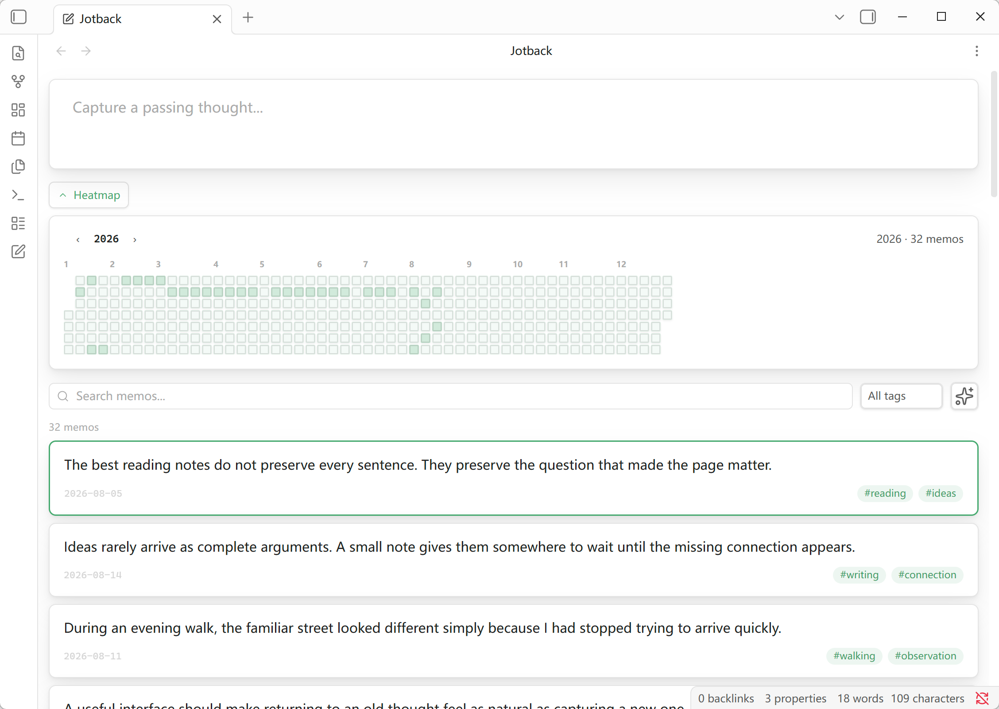
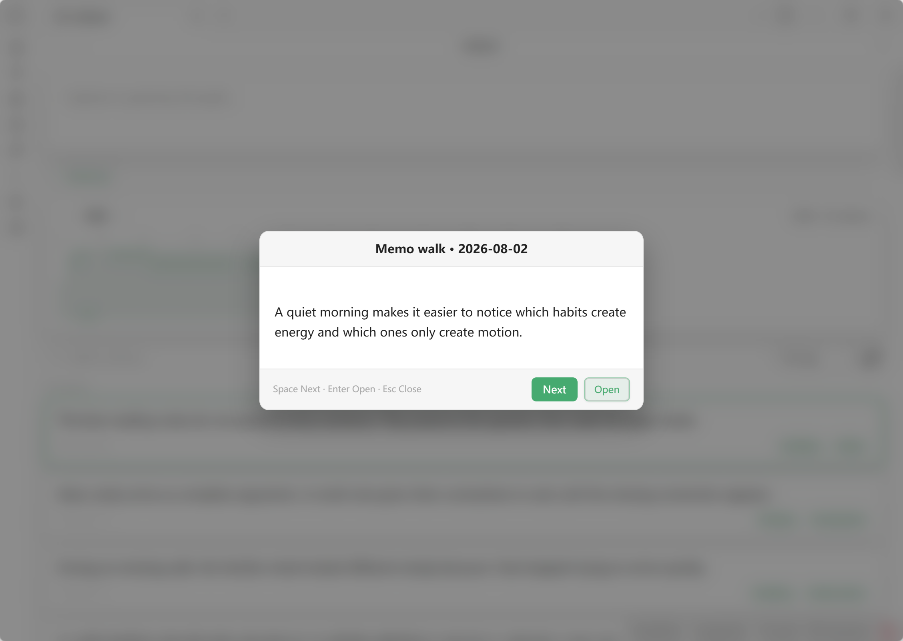
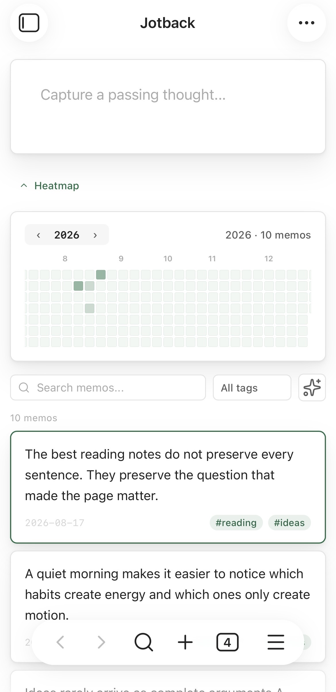
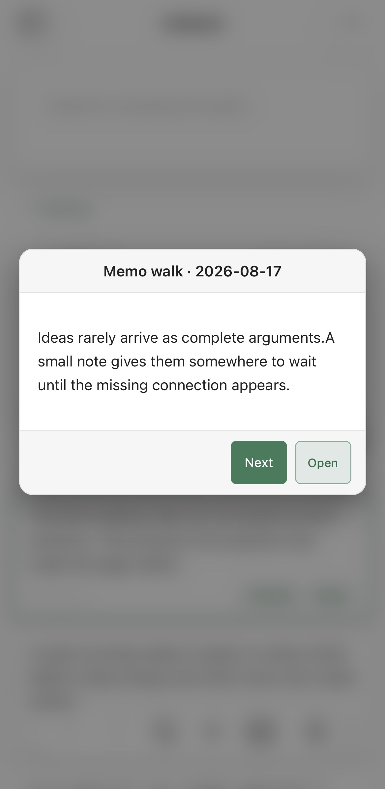

# Jotback for Obsidian

**Jot down. Look back.**

Jotback is a lightweight Obsidian plugin for capturing short thoughts and bringing them back into view over time.

> Work in progress — the core experience is implemented, but the plugin has not yet been released to the Obsidian community plugin registry.

Each memo is stored as an individual timestamped Markdown file. Your notes remain plain text, searchable through Obsidian, and portable without the plugin.

## Features

- **Quick capture** — open the Jotback view from the ribbon or command palette and save a memo without leaving the view.
- **Markdown rendering** — display memo content using Obsidian's Markdown renderer.
- **Search and tag filtering** — filter memos by text or YAML tag using Obsidian's standard `tags` property.
- **Configurable storage folder** — choose the vault folder used to save and load memos; the default is `memos/`.
- **Pinned-first timeline** — show pinned memos first, then order the remainder by creation time.
- **Incremental loading** — render 50 memos at a time to keep larger collections responsive.
- **Heatmap** — browse memo activity by year and filter the list to a selected day.
- **Random review** — rediscover a random memo in a focused review dialog or open a random memo directly from the command palette.
- **Responsive interface** — supports desktop and mobile layouts, Obsidian themes, keyboard navigation, and reduced-motion preferences.
- **System-language interface** — follows Obsidian's configured language for English and Chinese, with English as the fallback.

## Screenshots

### Desktop

| Main view | Random review |
| --- | --- |
|  |  |

### Mobile

<p align="center">
  
  
</p>

## Memo format

New memos use timestamped filenames in the following format:

```text
YYYY-MM-DD-HHMMSS-mmm.md
```

Their Markdown content uses frontmatter for metadata:

```markdown
---
created: 2026-08-13 20:13:30
pinned: false
tags:
  - research
  - obsidian
---
Turn reading notes into searchable memos.
```

When a memo is loaded, its creation time is resolved in this order:

1. A valid frontmatter `created` value.
2. A timestamp in the standard filename.
3. The file creation time reported by the vault.

YAML `tags` are the single source for card tag chips and tag filtering. Hashtags written in the memo body remain part of the rendered Markdown content, but Jotback does not convert them into metadata or duplicate them in the card footer. New memos start with an empty `tags: []` property that can be edited through Obsidian's Properties interface.

Jotback only creates and manages `created`, `pinned`, and `tags`. Obsidian's standard `aliases` and `cssclasses` properties are neither added nor modified by the plugin.

## Storage folder

The default memo folder is `memos/`. To use another location, open **Settings → Jotback → Memo storage folder** and choose or enter a path relative to the vault root, for example `Notes/Jotback`.

Leading, trailing, repeated, and Windows-style separators are normalized. Changing the setting does not move existing memo files; move them in Obsidian's file explorer if they should appear in the new location.

## Language

The interface follows the language configured in Obsidian:

- Chinese language variants use the Chinese interface.
- English and all other languages use the English interface.

Reload the plugin or restart Obsidian after changing the application language so that all existing views and commands are rebuilt with the new locale.

## Commands

| Command | Action |
| --- | --- |
| `Jotback: Open view` | Open or reveal the Jotback view. |
| `Jotback: Open random memo` | Open a randomly selected memo as a Markdown file. |

The sparkle button in the Jotback view opens the random-review dialog. Its desktop keyboard controls are:

| Key | Action |
| --- | --- |
| `Space` | Show another random memo. |
| `Enter` | Open the current memo. |
| `Esc` | Close random review. |
| `Tab` / `Shift+Tab` | Move between controls while keeping focus inside the dialog. |

On desktop and mobile, clicking or tapping outside the random-review card also closes it.

The heatmap exposes one date in the `Tab` order. Use `Up` / `Down` to move by one day, `Left` / `Right` to move by one week, and `Home` / `End` to reach the first or last day of the year. Press `Enter` or `Space` to apply the date filter. Memo cards and tag filters are also keyboard accessible.

## Privacy

Jotback works entirely inside the local Obsidian vault. It makes no network requests, requires no account or payment, and includes no advertising, analytics, or telemetry.

## Development

### Requirements

- Node.js and npm
- An Obsidian vault for manual testing

### Install dependencies

```bash
npm install
```

### Run tests

```bash
npm test
```

The test suite covers frontmatter parsing, YAML-only tag handling, folder-path normalization, filename dates, creation-time fallback behaviour, and repository caching.

### Run the community-guideline checks

```bash
npm run lint
```

This runs the official `eslint-plugin-obsidianmd` recommended rules against the plugin source.

### Build

```bash
npm run build
```

The production build type-checks the TypeScript source and bundles it with esbuild into `main.js`. The current build configuration also copies `main.js`, `manifest.json`, and `styles.css` into the bundled `test-vault` for local testing.

For continuous rebuilds during development:

```bash
npm run dev
```

## Manual installation

Copy these files into `<your-vault>/.obsidian/plugins/jotback/`:

```text
main.js
manifest.json
styles.css
```

Then enable **Jotback** under Obsidian's community plugin settings.

## Project structure

```text
src/main.ts       Plugin lifecycle, commands, and settings
src/i18n.ts       English and Chinese interface translations
src/view.ts       Jotback view composition, filtering, and card rendering
src/repository.ts Cached, batched memo loading and data aggregation
src/heatmap.ts    Activity heatmap rendering and date selection
src/random-review.ts Random-review dialog and keyboard interaction
src/types.ts      Shared memo data types
src/utils.ts      Frontmatter, tags, filenames, and date utilities
tests/            Utility and repository regression tests
styles.css        Plugin interface styles
main.js           Generated plugin bundle
```

## Tech stack

TypeScript · Obsidian API · esbuild · Node.js test runner

## Licence

MIT © 2026 yniany
